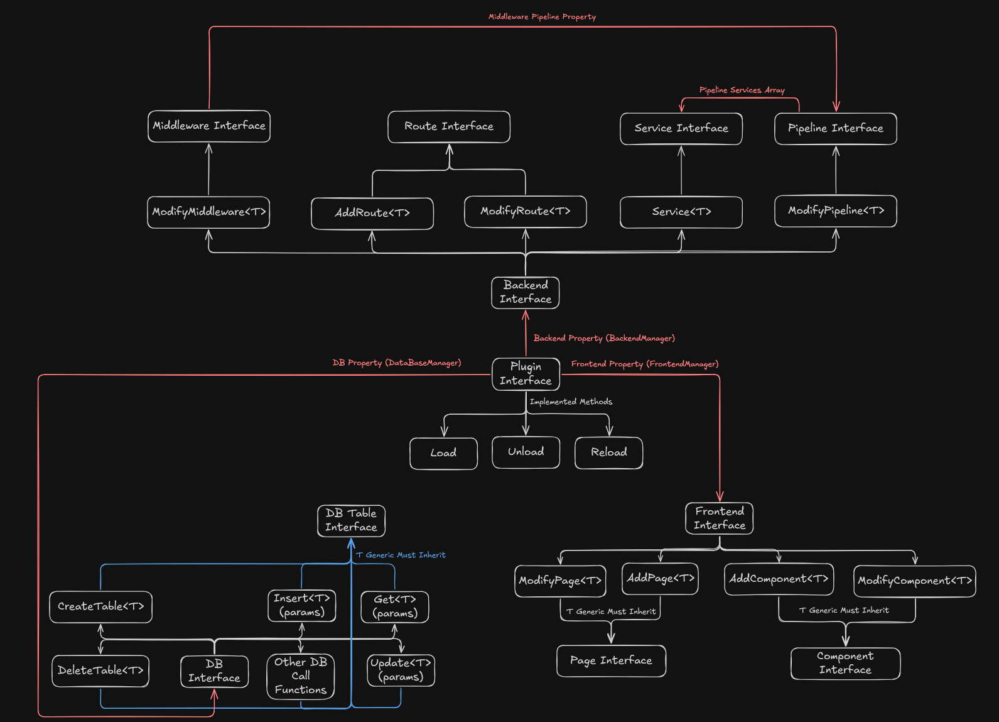
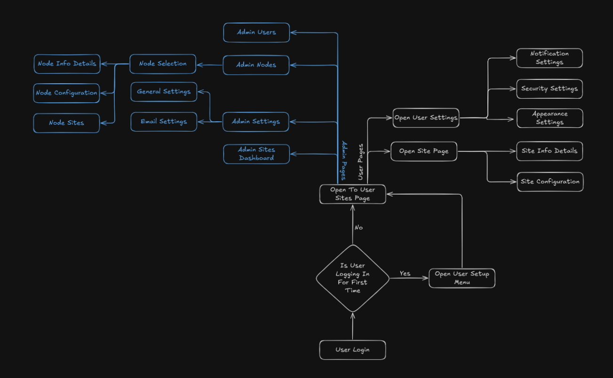

# Archon - Docker Site Management Platform

Archon is a complete Docker-based web hosting management platform consisting of a powerful Terminal UI (TUI) client and remote node servers for managing multiple sites across different servers.

## Architecture

```
┌─────────────────────────────────────────────────────────────┐
│                     Archon TUI Client                       │
│  (Terminal User Interface for Management)                   │
│  - Manage Sites, Domains, and Nodes                         │
│  - Configure DNS records                                    │
│  - Deploy and monitor containers                            │
│  - Mouse & keyboard navigation                              │
└──────────────────┬──────────────────────────────────────────┘
                   │ REST API
                   │
     ┌─────────────┼─────────────┬─────────────┐
     │             │             │             │
     ▼             ▼             ▼             ▼
┌─────────┐   ┌─────────┐   ┌─────────┐   ┌─────────┐
│  Node 1 │   │  Node 2 │   │  Node 3 │   │  Node N │
│─────────│   │─────────│   │─────────│   │─────────│
│ Nginx   │   │ Apache  │   │ Traefik │   │ Custom  │
│ Docker  │   │ Docker  │   │ Docker  │   │ Docker  │
│ Sites   │   │ Sites   │   │ Sites   │   │ Sites   │
└─────────┘   └─────────┘   └─────────┘   └─────────┘
```

## Features

### Archon TUI Client

- **Modern Terminal UI**: Beautiful, mouse-enabled interface built with [Bubbletea](https://github.com/charmbracelet/bubbletea) and [Lipgloss](https://github.com/charmbracelet/lipgloss)
- **Tab Navigation**: Click or use keyboard to navigate between Dashboard, Sites, Domains, and Nodes
- **Site Management**: Create, deploy, and manage Docker-based websites
- **Domain Management**: Configure domains with DNS provider integration (Cloudflare, Route53, Manual)
- **Node Management**: Manage multiple remote servers from one interface
- **Configuration Files**: Attach custom config files to containers for nginx.conf, php.ini, etc.
- **Real-time Status**: Monitor deployment status, container health, and node availability
- **Mouse Support**: Full mouse support with clickable tabs and form fields

### Archon Node Server

- **Docker Integration**: Deploy and manage Docker containers with automatic networking
- **Multiple Reverse Proxies**: Choose from Nginx, Apache, or Traefik
- **SSL Management**:
  - **Manual Mode**: Upload your own SSL certificates
  - **Let's Encrypt**: Automatic SSL certificate generation with certbot
  - **Traefik Auto**: Let Traefik handle SSL automatically
- **REST API**: Full API for remote management and automation
- **Health Monitoring**: Track Docker status, proxy health, and container metrics
- **Config File Support**: Inject custom configuration files into containers

## Screenshots





## Quick Start

### 1. Install Archon TUI Client

```bash
# Clone the repository
git clone https://github.com/BlueBeard63/Archon.git
cd Archon

# Build the TUI client
cd archon
go build -o archon

# Install to system path (optional)
sudo cp archon /usr/local/bin/
sudo chmod +x /usr/local/bin/archon
```

### 2. Setup Archon Node Server

On each remote server where you want to host sites:

```bash
# Build the node server
cd node
go build -o archon-node

# Install to system path
sudo cp archon-node /usr/local/bin/
sudo chmod +x /usr/local/bin/archon-node

# Create configuration directory
sudo mkdir -p /etc/archon

# Create configuration file (see Configuration section below)
sudo nano /etc/archon/node-config.toml

# Run the node server
archon-node --config /etc/archon/node-config.toml
```

### 3. Launch Archon TUI

```bash
archon
```

On first launch, Archon creates a default configuration at `~/.config/archon/config.toml`.

## Installation

### Prerequisites

- **Go 1.22+** (for building from source)
- **Terminal with mouse support** (most modern terminals)

### TUI Client Dependencies

The client uses the following Go packages (automatically installed via `go build`):
- `github.com/charmbracelet/bubbletea` - TUI framework
- `github.com/charmbracelet/lipgloss` - Styling
- `github.com/charmbracelet/bubbles` - UI components
- `github.com/lrstanley/bubblezone` - Mouse zone support
- `github.com/google/uuid` - UUID generation
- `github.com/pelletier/go-toml/v2` - TOML configuration

### Node Server Requirements

**All Modes:**
- Docker installed and running
- Go 1.22+ (for building)

**Nginx Mode:**
- Nginx installed
- Permission to write to nginx config directory
- Permission to reload nginx

**Apache Mode:**
- Apache2 installed with `mod_proxy` and `mod_ssl` enabled
- Permission to write to apache config directory
- Permission to reload apache

**Traefik Mode:**
- Traefik running as a Docker container
- Traefik configured with Docker provider
- Docker socket mounted to Traefik

**Let's Encrypt Mode:**
- Certbot installed
- Port 80 accessible from internet
- Valid domain pointing to server

## Configuration

### TUI Client Configuration

Located at `~/.config/archon/config.toml`:

```toml
version = "1.0.0"

[settings]
auto_save = true
health_check_interval_secs = 60
default_dns_ttl = 3600
theme = "default"

# Nodes are defined here
[[nodes]]
id = "550e8400-e29b-41d4-a716-446655440000"
name = "Production Server"
api_endpoint = "https://server1.example.com:8080"
api_key = "your-secure-api-key"
ip_address = "192.168.1.100"
status = "online"

# Sites configuration
[[sites]]
id = "650e8400-e29b-41d4-a716-446655440001"
name = "mywebsite"
domain_id = "750e8400-e29b-41d4-a716-446655440002"
node_id = "550e8400-e29b-41d4-a716-446655440000"
docker_image = "nginx:latest"
port = 8080
ssl_enabled = true

# Domains configuration
[[domains]]
id = "750e8400-e29b-41d4-a716-446655440002"
name = "example.com"
traefik_enabled = false

[domains.dns_provider]
type = "cloudflare"
api_token = "your-cloudflare-token"
zone_id = "your-zone-id"
```

### Node Server Configuration

#### Example: Nginx with Let's Encrypt

Create `/etc/archon/node-config.toml`:

```toml
[server]
host = "0.0.0.0"
port = 8080
api_key = "generate-a-strong-random-key-here"
data_dir = "/var/lib/archon"

[proxy]
type = "nginx"
config_dir = "/etc/nginx/sites-enabled"
reload_command = "nginx -s reload"

[docker]
host = "unix:///var/run/docker.sock"
network = "archon-net"

[ssl]
mode = "letsencrypt"
cert_dir = "/etc/archon/ssl"
email = "admin@example.com"

[letsencrypt]
enabled = true
email = "admin@example.com"
staging_mode = false
```

#### Example: Traefik with Auto SSL

```toml
[server]
host = "0.0.0.0"
port = 8080
api_key = "generate-a-strong-random-key-here"
data_dir = "/var/lib/archon"

[proxy]
type = "traefik"
config_dir = ""
reload_command = ""

[docker]
host = "unix:///var/run/docker.sock"
network = "archon-net"

[ssl]
mode = "traefik-auto"
cert_dir = ""
email = "admin@example.com"
```

See the [node/README.md](node/README.md) for more configuration examples.

## Usage Guide

### Setting Up a New Node

1. **Install Node Server** on your remote server (see Installation section above)
2. **Configure the node** with appropriate proxy and SSL settings
3. **Start the node server** as a systemd service or manually
4. **Add the node in Archon TUI**:
   - Launch Archon TUI
   - Click on the **Nodes** tab or press `3`
   - Press `n` to create a new node
   - Fill in:
     - Name: Friendly name for the server
     - API Endpoint: `http://server-ip:8080` or `https://server-ip:8080`
     - API Key: The key from your node-config.toml
     - IP Address: Server's public IP address
   - Press Enter to save

### Creating a Domain

1. Click on the **Domains** tab or press `2`
2. Press `n` to create a new domain
3. Enter the domain name (e.g., `example.com`)
4. Domain is created with Manual DNS by default
5. To configure DNS provider (Cloudflare/Route53):
   - Edit `~/.config/archon/config.toml`
   - Update the domain's `dns_provider` section
   - Restart Archon TUI

**DNS Provider Configuration:**

```toml
[[domains]]
id = "..."
name = "example.com"

# For Cloudflare
[domains.dns_provider]
type = "cloudflare"
api_token = "your-cloudflare-api-token"
zone_id = "your-cloudflare-zone-id"

# For Route53
[domains.dns_provider]
type = "route53"
access_key = "your-aws-access-key"
secret_key = "your-aws-secret-key"
hosted_zone_id = "your-hosted-zone-id"

# For Manual DNS
[domains.dns_provider]
type = "manual"
```

### Creating and Deploying a Site

1. Click on the **Sites** tab or press `1`
2. Press `n` to create a new site
3. Fill in the form:
   - **Name**: Site identifier (e.g., `myapp`)
   - **Domain**: Domain name (must exist in Domains)
   - **Node**: Node name (must exist in Nodes)
   - **Docker Image**: Docker image to deploy (e.g., `nginx:latest`, `wordpress:latest`)
   - **Port**: Internal container port (e.g., `80`, `8080`)
4. Press Enter to create the site
5. The site will be deployed to the selected node automatically

### Managing DNS Records

1. Navigate to **Domains** tab
2. Select a domain
3. View DNS records for the domain
4. Add/edit/delete records as needed
5. For Cloudflare/Route53: Changes sync automatically
6. For Manual DNS: Configure records at your DNS provider manually

### SSL Certificate Management

SSL is handled automatically by the node server based on its configuration:

- **Let's Encrypt Mode**: Certificates are generated automatically when site is deployed
- **Traefik Auto Mode**: Traefik handles SSL via Docker labels
- **Manual Mode**: Upload certificates when deploying the site

### Attaching Configuration Files

When creating a site, you can attach custom configuration files that will be mounted into the container:

```toml
[[sites]]
# ... other site config ...

[[sites.config_files]]
name = "nginx.conf"
container_path = "/etc/nginx/nginx.conf"
content = """
server {
    listen 80;
    server_name example.com;
    # ... your nginx config ...
}
"""

[[sites.config_files]]
name = "php.ini"
container_path = "/usr/local/etc/php/php.ini"
content = """
upload_max_filesize = 64M
post_max_size = 64M
"""
```

## Keyboard Shortcuts

### Global
- `Ctrl+C` / `q`: Quit application
- `Esc`: Go back / Cancel
- `?`: Show help screen

### Navigation
- `0` / `Tab`: Dashboard
- `1` / `s`: Sites
- `2` / `d`: Domains
- `3` / `n`: Nodes
- **Or click on tabs with your mouse!**

### Lists
- `n` / `c`: Create new item
- `Enter`: View details
- `d`: Delete selected item

### Forms
- `Tab` / `Shift+Tab`: Navigate between fields
- **Or click on fields with your mouse!**
- Type to input text
- `Backspace`: Delete character
- `Enter`: Submit form
- `Esc`: Cancel

## Mouse Support

Archon TUI features full mouse support powered by [bubblezone](https://github.com/lrstanley/bubblezone):

- **Click on tabs** to navigate between screens
- **Click on form fields** to focus and edit them
- **Click on menu items** to trigger actions
- Works in most modern terminals (iTerm2, Windows Terminal, Alacritty, etc.)

## Systemd Service for Node Server

Create `/etc/systemd/system/archon-node.service`:

```ini
[Unit]
Description=Archon Node Server
After=network.target docker.service

[Service]
Type=simple
User=root
ExecStart=/usr/local/bin/archon-node --config /etc/archon/node-config.toml
Restart=on-failure
RestartSec=5s

[Install]
WantedBy=multi-user.target
```

Enable and start:

```bash
sudo systemctl daemon-reload
sudo systemctl enable archon-node
sudo systemctl start archon-node
sudo systemctl status archon-node
```

## DNS Provider Setup

### Cloudflare

1. Log in to Cloudflare dashboard
2. Go to **My Profile** > **API Tokens**
3. Create token with:
   - Zone - DNS - Edit permissions
   - Specific zone access
4. Copy the token and zone ID
5. Add to domain configuration in `config.toml`

### Route53

1. Create IAM user with `route53:ChangeResourceRecordSets` permission
2. Generate access key and secret key
3. Note your hosted zone ID
4. Add to domain configuration in `config.toml`

### Manual DNS

For providers not yet supported, use manual mode:
1. Create domain with manual DNS
2. Add DNS records in Archon (for tracking)
3. Manually configure records at your DNS provider
4. Archon will track the records but not sync them

## API Documentation

The node server exposes a REST API for automation. See [node/README.md](node/README.md) for full API documentation.

### Quick API Examples

```bash
# Deploy a site
curl -X POST http://node-server:8080/api/v1/sites/deploy \
  -H "Authorization: Bearer your-api-key" \
  -H "Content-Type: application/json" \
  -d '{
    "id": "uuid-here",
    "name": "myapp",
    "domain": "example.com",
    "docker_image": "nginx:latest",
    "port": 80,
    "ssl_enabled": true
  }'

# Check health
curl http://node-server:8080/health

# Get site status
curl http://node-server:8080/api/v1/sites/{siteID}/status \
  -H "Authorization: Bearer your-api-key"
```

## Troubleshooting

### TUI Client Issues

**Config file not found:**
```bash
# Create config directory
mkdir -p ~/.config/archon

# Archon will create default config on first run
archon
```

**Mouse clicks not working:**
- Ensure your terminal supports mouse events (iTerm2, Windows Terminal, Alacritty, etc.)
- Try a different terminal emulator
- Check terminal settings for mouse support

### Node Server Issues

**Cannot connect to node:**
- Verify node server is running: `systemctl status archon-node`
- Check firewall allows port 8080
- Verify API endpoint URL is correct
- Ensure API key matches between TUI config and node config

**Docker deployment fails:**
- Check Docker is running: `systemctl status docker`
- Verify Docker socket is accessible: `docker ps`
- Check container logs for errors

**SSL certificate errors:**
```bash
# Check certbot logs (Let's Encrypt mode)
sudo tail -f /var/log/letsencrypt/letsencrypt.log

# Verify domain points to server
dig example.com

# Test with staging mode first
[letsencrypt]
staging_mode = true
```

**Reverse proxy configuration errors:**
```bash
# Test nginx config
sudo nginx -t

# Test apache config
sudo apache2ctl configtest

# Reload proxy
sudo systemctl reload nginx
# or
sudo systemctl reload apache2
```

## Development

### Project Structure

```
archon/
├── archon/                 # TUI client
│   ├── internal/
│   │   ├── app/           # Bubbletea application
│   │   ├── models/        # Data models
│   │   ├── state/         # Application state
│   │   ├── config/        # Configuration loader
│   │   ├── api/           # Node API client
│   │   ├── dns/           # DNS provider integrations
│   │   └── ui/            # UI components and screens
│   │       ├── components/  # Reusable UI components
│   │       └── screens/     # Screen renderers
│   ├── go.mod
│   └── main.go
├── node/                   # Node server
│   ├── internal/
│   │   ├── api/           # API handlers
│   │   ├── docker/        # Docker integration
│   │   ├── proxy/         # Reverse proxy configs
│   │   └── ssl/           # SSL management
│   ├── go.mod
│   ├── main.go
│   └── README.md
├── imgs/                   # Screenshots
└── README.md              # This file
```

### Building from Source

```bash
# Build TUI client
cd archon
go build -o archon

# Build node server
cd ../node
go build -o archon-node

# Run tests (if available)
go test ./...
```

### Contributing

Contributions are welcome! Areas for improvement:

- [ ] Additional DNS provider support (Namecheap, GoDaddy, etc.)
- [ ] Container metrics dashboard
- [ ] Log streaming in TUI
- [ ] Site templates / presets
- [ ] Backup and restore functionality
- [ ] Multi-container sites (docker-compose support)
- [ ] Health check automation
- [ ] Notification system (email, Slack, etc.)

## Security Considerations

1. **API Keys**: Use strong, randomly-generated API keys
   ```bash
   # Generate a secure API key
   openssl rand -base64 32
   ```

2. **SSL Certificates**: Store private keys with restricted permissions
   ```bash
   sudo chmod 600 /etc/archon/ssl/*.key
   ```

3. **Docker Socket**: Access to Docker socket grants root-level permissions
   - Run node server as dedicated user where possible
   - Use Docker socket proxy for additional security

4. **Firewall**: Restrict access to node API port
   ```bash
   # Allow only from specific IP
   sudo ufw allow from YOUR_IP to any port 8080
   ```

5. **HTTPS**: Use HTTPS for node API in production
   - Configure reverse proxy in front of node server
   - Or use API over VPN/private network

## License

MIT License - See LICENSE file for details

## Credits

Built with:
- [Bubbletea](https://github.com/charmbracelet/bubbletea) - TUI framework
- [Lipgloss](https://github.com/charmbracelet/lipgloss) - Terminal styling
- [Bubbles](https://github.com/charmbracelet/bubbles) - TUI components
- [Bubblezone](https://github.com/lrstanley/bubblezone) - Mouse zone support
- [Docker](https://www.docker.com/) - Container runtime
- [Traefik](https://traefik.io/) / [Nginx](https://nginx.org/) / [Apache](https://httpd.apache.org/) - Reverse proxies
- [Let's Encrypt](https://letsencrypt.org/) - Free SSL certificates

## Support

For issues, questions, or contributions:
- Open an issue on GitHub
- Check existing issues for solutions
- Review troubleshooting section above

---

**Happy hosting! 🚀**
