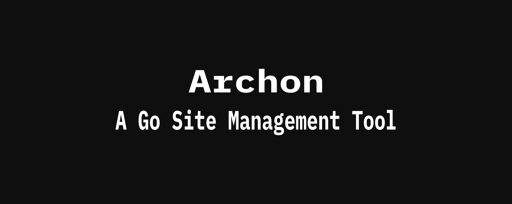
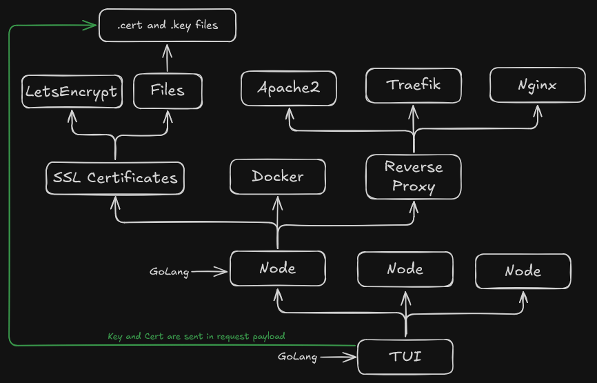
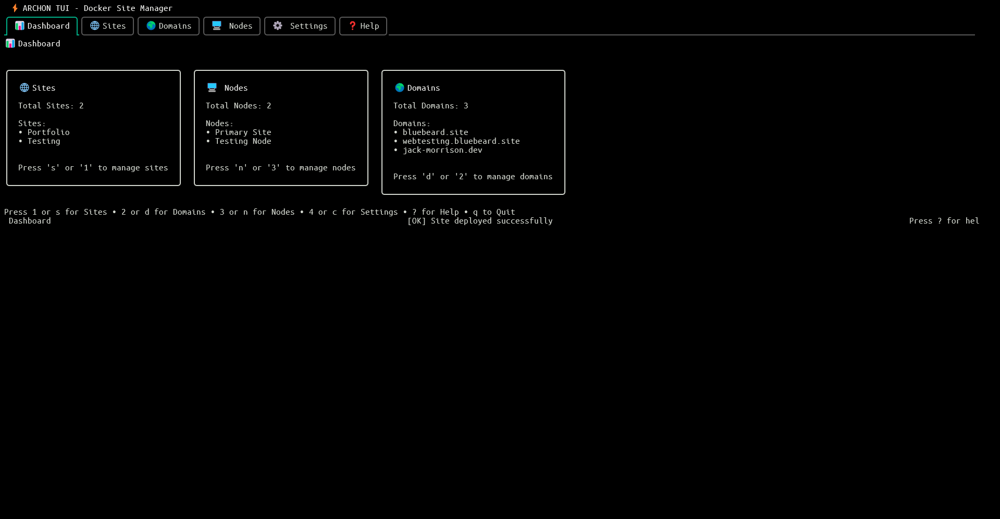
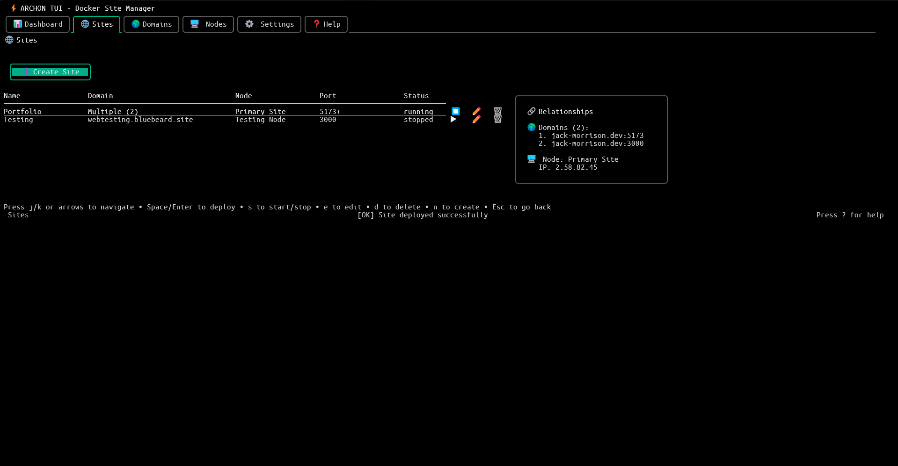
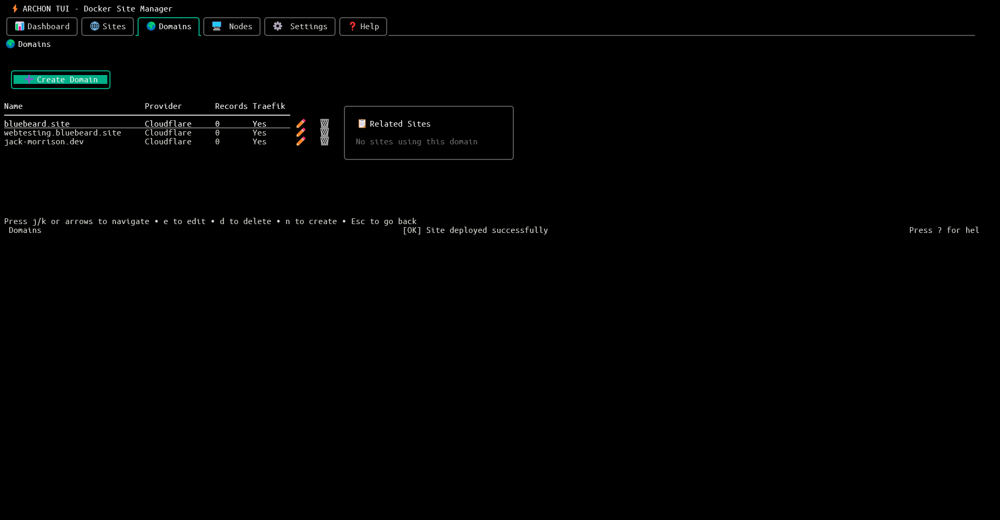
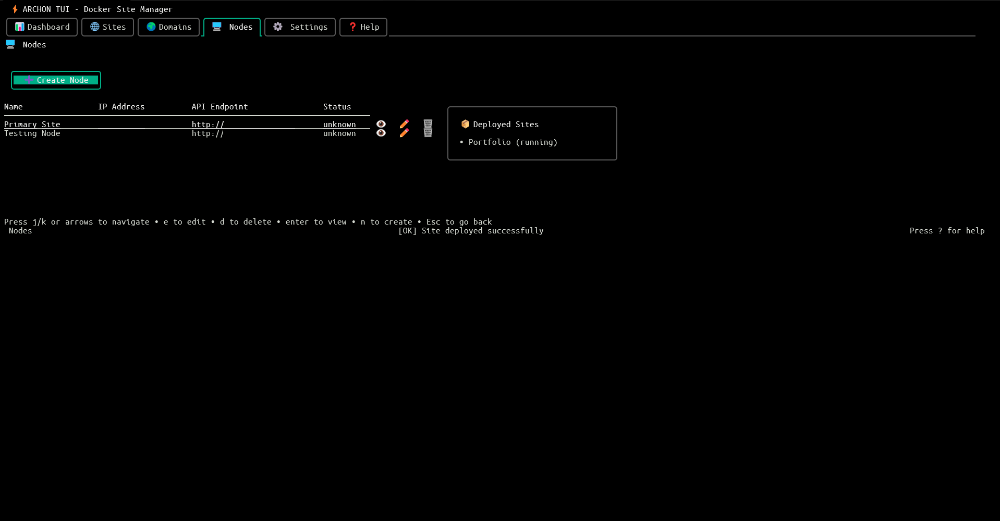
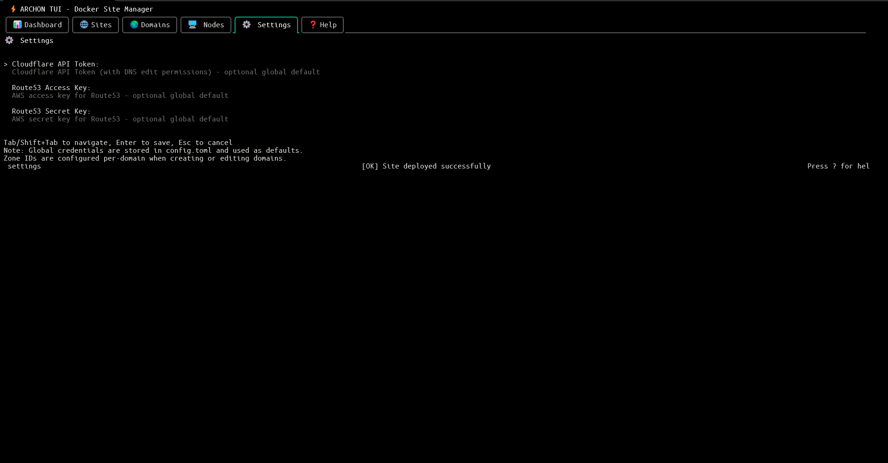
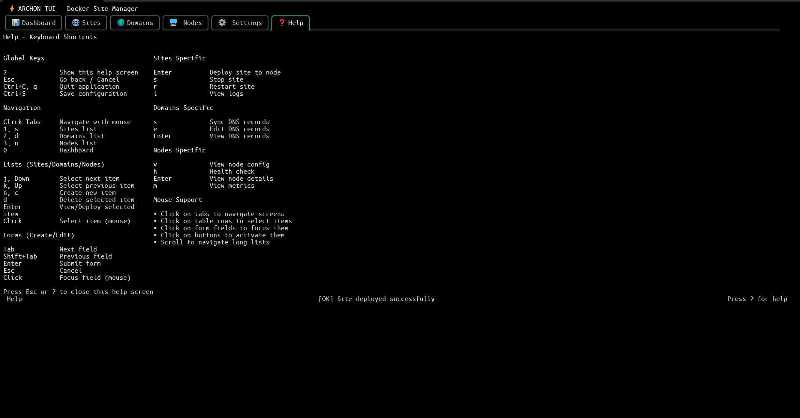

<div align="center">



# Archon

### Docker Site Management Platform

[](https://go.dev/)
[](LICENSE)
[]()

**A powerful Terminal UI client and distributed node system for managing Docker-based web hosting across multiple servers.**

[🌐 Project Page](https://jack-morrison.dev/projects/archon) · [📖 Documentation](#documentation) · [🚀 Quick Start](#quick-start)

</div>

---

## Table of Contents

- [Overview](#overview)
- [Architecture](#architecture)
- [Features](#features)
- [Screenshots](#screenshots)
- [Quick Start](#quick-start)
- [Installation](#installation)
- [Configuration](#configuration)
- [Usage Guide](#usage-guide)
- [Keyboard Shortcuts](#keyboard-shortcuts)
- [API Documentation](#api-documentation)
- [Troubleshooting](#troubleshooting)
- [Security](#security)
- [Contributing](#contributing)
- [License](#license)

---

## Overview

Archon simplifies the complexity of managing Docker containers across multiple servers. Whether you're running a single server or orchestrating deployments across a fleet of nodes, Archon provides a unified interface for:

- **Deploying containerized applications** with automatic reverse proxy configuration
- **Managing SSL certificates** via Let's Encrypt or manual upload
- **Configuring DNS records** through Cloudflare, Route53, or manual management
- **Monitoring container health** and deployment status in real-time

---

## Architecture

### System Flow

Archon follows a **client-node architecture** where the TUI client communicates with remote node servers via REST API and WebSocket connections.

**1. TUI Client Layer**
- Beautiful terminal interface built with [Bubbletea](https://github.com/charmbracelet/bubbletea)
- Manages sites, domains, and node configurations
- Sends deployment commands to remote nodes
- Receives real-time progress updates via WebSocket

**2. Node Server Layer**
- Runs on each hosting server
- Orchestrates Docker container lifecycle
- Configures reverse proxies (Nginx/Apache/Traefik)
- Manages SSL certificates automatically

**3. Deployment Flow**
```
User → TUI → Node API → Docker + Proxy + SSL
```
When you deploy a site:
1. TUI sends deployment request to the target node
2. Node pulls the Docker image
3. Container is created with proper networking
4. Reverse proxy is configured for the domain
5. SSL certificate is obtained (if enabled)
6. Status is reported back to TUI in real-time

<br />


### Project Architecture 
<br />



<br/>

**Communication Protocols:**
- **REST API** — Standard operations (deploy, stop, restart, delete)
- **WebSocket** — Real-time deployment progress with step-by-step feedback

**Supported Reverse Proxies:**
- Nginx
- Apache
- Traefik (with Docker provider)

**SSL Modes:**
- Let's Encrypt (automatic)
- Manual certificate upload
- Traefik auto-managed

---

## Features

### Archon TUI Client

| Feature | Description |
|---------|-------------|
| 🖥️ **Modern Terminal UI** | Beautiful, mouse-enabled interface built with [Bubbletea](https://github.com/charmbracelet/bubbletea) and [Lipgloss](https://github.com/charmbracelet/lipgloss) |
| 🗂️ **Tab Navigation** | Click or use keyboard to navigate between Dashboard, Sites, Domains, and Nodes |
| 🚀 **Site Management** | Create, deploy, and manage Docker-based websites |
| 🌐 **Domain Management** | Configure domains with DNS provider integration (Cloudflare, Route53, Manual) |
| 🖧 **Node Management** | Manage multiple remote servers from one interface |
| 📄 **Configuration Files** | Attach custom config files to containers (nginx.conf, php.ini, etc.) |
| 📊 **Real-time Status** | Monitor deployment status, container health, and node availability |
| 🖱️ **Mouse Support** | Full mouse support with clickable tabs and form fields |

### Archon Node Server

| Feature | Description |
|---------|-------------|
| 🐳 **Docker Integration** | Deploy and manage containers with automatic networking |
| 🔄 **Multiple Proxies** | Choose from Nginx, Apache, or Traefik |
| 🔒 **SSL Management** | Manual upload, Let's Encrypt auto-renewal, or Traefik-managed |
| 🔌 **REST API** | Full API for remote management and automation |
| 💓 **Health Monitoring** | Track Docker status, proxy health, and container metrics |
| ⚙️ **Config Injection** | Mount custom configuration files into containers |

---

## Screenshots

<table>
<tr>
<td align="center" width="50%">

<br/><b>Dashboard</b> — System overview and quick actions
</td>
<td align="center" width="50%">

<br/><b>Sites</b> — Manage deployed applications
</td>
</tr>
<tr>
<td align="center">

<br/><b>Domains</b> — DNS and domain configuration
</td>
<td align="center">

<br/><b>Nodes</b> — Remote server management
</td>
</tr>
</table>

<details>
<summary><b>View More Screenshots</b></summary>
<br/>
<table>
<tr>
<td align="center" width="50%">

<br/><b>Settings</b> — Application configuration
</td>
<td align="center" width="50%">

<br/><b>Help</b> — Keyboard shortcuts and documentation
</td>
</tr>
</table>
</details>

---

## Quick Start

### Option 1: Using Install Script (Recommended)

```bash
# Clone the repository
git clone https://github.com/BlueBeard63/Archon.git
cd Archon/archon

# Run the install script
./install.sh
```

### Option 2: Manual Installation

```bash
# Clone the repository
git clone https://github.com/BlueBeard63/Archon.git
cd Archon/archon

# Build and install
go build -o archon
sudo cp archon /usr/local/bin/
```

### Launch Archon

```bash
archon
```

On first launch, Archon creates a default configuration at `~/.config/archon/config.toml`.

> 📘 **Setting up Node Servers?** See the [Node Server Setup](#setting-up-a-new-node) section or the detailed [Node README](node/README.md).

---

## Installation

### Prerequisites

| Component | Requirement |
|-----------|-------------|
| **Go** | 1.22+ (for building from source) |
| **Terminal** | Mouse support recommended (iTerm2, Windows Terminal, Alacritty) |
| **Docker** | Required on node servers |

### TUI Client Dependencies

The client uses the following Go packages (automatically installed via `go build`):

| Package | Purpose |
|---------|---------|
| `github.com/charmbracelet/bubbletea` | TUI framework |
| `github.com/charmbracelet/lipgloss` | Terminal styling |
| `github.com/charmbracelet/bubbles` | UI components |
| `github.com/lrstanley/bubblezone` | Mouse zone support |
| `github.com/google/uuid` | UUID generation |
| `github.com/pelletier/go-toml/v2` | TOML configuration |

### Node Server Requirements

<details>
<summary><b>Nginx Mode</b></summary>

- Nginx installed
- Permission to write to nginx config directory
- Permission to reload nginx
</details>

<details>
<summary><b>Apache Mode</b></summary>

- Apache2 installed with `mod_proxy` and `mod_ssl` enabled
- Permission to write to apache config directory
- Permission to reload apache
</details>

<details>
<summary><b>Traefik Mode</b></summary>

- Traefik running as a Docker container
- Traefik configured with Docker provider
- Docker socket mounted to Traefik
</details>

<details>
<summary><b>Let's Encrypt SSL</b></summary>

- Certbot installed
- Port 80 accessible from internet
- Valid domain pointing to server
</details>

---

## Configuration

### TUI Client Configuration

Located at `~/.config/archon/config.toml`:

```toml
version = "1.0.0"

[settings]
auto_save = true
health_check_interval_secs = 60
default_dns_ttl = 3600
theme = "default"

# Nodes are defined here
[[nodes]]
id = "550e8400-e29b-41d4-a716-446655440000"
name = "Production Server"
api_endpoint = "https://server1.example.com:8080"
api_key = "your-secure-api-key"
ip_address = "192.168.1.100"
status = "online"

# Sites configuration
[[sites]]
id = "650e8400-e29b-41d4-a716-446655440001"
name = "mywebsite"
domain_id = "750e8400-e29b-41d4-a716-446655440002"
node_id = "550e8400-e29b-41d4-a716-446655440000"
docker_image = "nginx:latest"
port = 8080
ssl_enabled = true

# Domains configuration
[[domains]]
id = "750e8400-e29b-41d4-a716-446655440002"
name = "example.com"
traefik_enabled = false

[domains.dns_provider]
type = "cloudflare"
api_token = "your-cloudflare-token"
zone_id = "your-zone-id"
```

### Node Server Configuration

#### Example: Nginx with Let's Encrypt

Create `/etc/archon/node-config.toml`:

```toml
[server]
host = "0.0.0.0"
port = 8080
api_key = "generate-a-strong-random-key-here"
data_dir = "/var/lib/archon"

[proxy]
type = "nginx"
config_dir = "/etc/nginx/sites-enabled"
reload_command = "nginx -s reload"

[docker]
host = "unix:///var/run/docker.sock"
network = "archon-net"

[ssl]
mode = "letsencrypt"
cert_dir = "/etc/archon/ssl"
email = "admin@example.com"

[letsencrypt]
enabled = true
email = "admin@example.com"
staging_mode = false
```

#### Example: Traefik with Auto SSL

```toml
[server]
host = "0.0.0.0"
port = 8080
api_key = "generate-a-strong-random-key-here"
data_dir = "/var/lib/archon"

[proxy]
type = "traefik"
config_dir = ""
reload_command = ""

[docker]
host = "unix:///var/run/docker.sock"
network = "archon-net"

[ssl]
mode = "traefik-auto"
cert_dir = ""
email = "admin@example.com"
```

See the [node/README.md](node/README.md) for more configuration examples.

## Usage Guide

### Setting Up a New Node

1. **Install Node Server** on your remote server (see Installation section above)
2. **Configure the node** with appropriate proxy and SSL settings
3. **Start the node server** as a systemd service or manually
4. **Add the node in Archon TUI**:
   - Launch Archon TUI
   - Click on the **Nodes** tab or press `3`
   - Press `n` to create a new node
   - Fill in:
     - Name: Friendly name for the server
     - API Endpoint: `http://server-ip:8080` or `https://server-ip:8080`
     - API Key: The key from your node-config.toml
     - IP Address: Server's public IP address
   - Press Enter to save

### Creating a Domain

1. Click on the **Domains** tab or press `2`
2. Press `n` to create a new domain
3. Enter the domain name (e.g., `example.com`)
4. Domain is created with Manual DNS by default
5. To configure DNS provider (Cloudflare/Route53):
   - Edit `~/.config/archon/config.toml`
   - Update the domain's `dns_provider` section
   - Restart Archon TUI

**DNS Provider Configuration:**

```toml
[[domains]]
id = "..."
name = "example.com"

# For Cloudflare
[domains.dns_provider]
type = "cloudflare"
api_token = "your-cloudflare-api-token"
zone_id = "your-cloudflare-zone-id"

# For Route53
[domains.dns_provider]
type = "route53"
access_key = "your-aws-access-key"
secret_key = "your-aws-secret-key"
hosted_zone_id = "your-hosted-zone-id"

# For Manual DNS
[domains.dns_provider]
type = "manual"
```

### Creating and Deploying a Site

1. Click on the **Sites** tab or press `1`
2. Press `n` to create a new site
3. Fill in the form:
   - **Name**: Site identifier (e.g., `myapp`)
   - **Domain**: Domain name (must exist in Domains)
   - **Node**: Node name (must exist in Nodes)
   - **Docker Image**: Docker image to deploy (e.g., `nginx:latest`, `wordpress:latest`)
   - **Port**: Internal container port (e.g., `80`, `8080`)
4. Press Enter to create the site
5. The site will be deployed to the selected node automatically

### Managing DNS Records

1. Navigate to **Domains** tab
2. Select a domain and view DNS records
3. Add/edit/delete records as needed
4. For Cloudflare/Route53: Changes sync automatically
5. For Manual DNS: Configure records at your DNS provider manually

### SSL Certificate Management

SSL is handled automatically by the node server based on its configuration:

| Mode | Behavior |
|------|----------|
| **Let's Encrypt** | Certificates generated automatically on deployment |
| **Traefik Auto** | Traefik handles SSL via Docker labels |
| **Manual** | Upload your own certificates when deploying |

### Attaching Configuration Files

Mount custom configuration files into containers:

```toml
[[sites.config_files]]
name = "nginx.conf"
container_path = "/etc/nginx/nginx.conf"
content = """
server {
    listen 80;
    server_name example.com;
}
"""
```

---

## Keyboard Shortcuts

<table>
<tr>
<td width="50%" valign="top">

### Global
| Key | Action |
|-----|--------|
| `Ctrl+C` / `q` | Quit application |
| `Esc` | Go back / Cancel |
| `?` | Show help screen |

### Navigation
| Key | Action |
|-----|--------|
| `0` / `Tab` | Dashboard |
| `1` / `s` | Sites |
| `2` / `d` | Domains |
| `3` / `n` | Nodes |

</td>
<td width="50%" valign="top">

### Lists
| Key | Action |
|-----|--------|
| `n` / `c` | Create new item |
| `Enter` | View details |
| `d` | Delete selected item |

### Forms
| Key | Action |
|-----|--------|
| `Tab` / `Shift+Tab` | Navigate fields |
| `Enter` | Submit form |
| `Esc` | Cancel |

</td>
</tr>
</table>

> 🖱️ **Mouse Support**: Click on tabs, form fields, and menu items. Works in iTerm2, Windows Terminal, Alacritty, and most modern terminals.

---

## Systemd Service

Run the node server as a systemd service for production deployments:

```ini
# /etc/systemd/system/archon-node.service
[Unit]
Description=Archon Node Server
After=network.target docker.service

[Service]
Type=simple
User=root
ExecStart=/usr/local/bin/archon-node --config /etc/archon/node-config.toml
Restart=on-failure
RestartSec=5s

[Install]
WantedBy=multi-user.target
```

```bash
sudo systemctl daemon-reload
sudo systemctl enable archon-node
sudo systemctl start archon-node
```

---

## DNS Provider Setup

<details>
<summary><b>Cloudflare</b></summary>

1. Log in to Cloudflare dashboard
2. Go to **My Profile** > **API Tokens**
3. Create token with Zone - DNS - Edit permissions
4. Copy the token and zone ID
5. Add to domain configuration in `config.toml`
</details>

<details>
<summary><b>Route53</b></summary>

1. Create IAM user with `route53:ChangeResourceRecordSets` permission
2. Generate access key and secret key
3. Note your hosted zone ID
4. Add to domain configuration in `config.toml`
</details>

<details>
<summary><b>Manual DNS</b></summary>

For providers not yet supported, use manual mode. Archon will track records locally but won't sync them—configure at your DNS provider manually.
</details>

---

## API Documentation

The node server exposes a REST API for automation. See [node/README.md](node/README.md) for full API documentation.

<details>
<summary><b>Quick API Examples</b></summary>

```bash
# Deploy a site
curl -X POST http://node-server:8080/api/v1/sites/deploy \
  -H "Authorization: Bearer your-api-key" \
  -H "Content-Type: application/json" \
  -d '{
    "id": "uuid-here",
    "name": "myapp",
    "domain": "example.com",
    "docker_image": "nginx:latest",
    "port": 80,
    "ssl_enabled": true
  }'

# Check health
curl http://node-server:8080/health

# Get site status
curl http://node-server:8080/api/v1/sites/{siteID}/status \
  -H "Authorization: Bearer your-api-key"
```
</details>

---

## Troubleshooting

<details>
<summary><b>TUI Client Issues</b></summary>

**Config file not found:**
```bash
mkdir -p ~/.config/archon
archon  # Will create default config on first run
```

**Mouse clicks not working:**
- Ensure your terminal supports mouse events
- Try iTerm2, Windows Terminal, or Alacritty
- Check terminal settings for mouse support
</details>

<details>
<summary><b>Node Connection Issues</b></summary>

- Verify node server is running: `systemctl status archon-node`
- Check firewall allows port 8080
- Verify API endpoint URL is correct
- Ensure API key matches between TUI config and node config
</details>

<details>
<summary><b>Docker Deployment Issues</b></summary>

- Check Docker is running: `systemctl status docker`
- Verify Docker socket is accessible: `docker ps`
- Check container logs for errors
</details>

<details>
<summary><b>SSL Certificate Errors</b></summary>

```bash
# Check certbot logs (Let's Encrypt mode)
sudo tail -f /var/log/letsencrypt/letsencrypt.log

# Verify domain points to server
dig example.com

# Test with staging mode first in config:
# staging_mode = true
```
</details>

<details>
<summary><b>Reverse Proxy Errors</b></summary>

```bash
# Test nginx config
sudo nginx -t

# Test apache config
sudo apache2ctl configtest

# Reload proxy
sudo systemctl reload nginx  # or apache2
```
</details>

---

## Security

| Area | Recommendation |
|------|----------------|
| **API Keys** | Use strong keys: `openssl rand -base64 32` |
| **SSL Certificates** | Restrict permissions: `chmod 600 /etc/archon/ssl/*.key` |
| **Docker Socket** | Run node as dedicated user or use Docker socket proxy |
| **Firewall** | Restrict API port: `ufw allow from YOUR_IP to any port 8080` |
| **HTTPS** | Use HTTPS for node API or run over VPN |

---

## Contributing

Contributions are welcome! Areas for improvement:

- [ ] Additional DNS providers (Namecheap, GoDaddy, etc.)
- [ ] Container metrics dashboard
- [ ] Log streaming in TUI
- [ ] Site templates / presets
- [ ] Backup and restore functionality
- [ ] Multi-container sites (docker-compose support)
- [ ] Health check automation
- [ ] Notification system (email, Slack, etc.)

### Building from Source

```bash
# Build TUI client
cd archon && go build -o archon

# Build node server  
cd node && go build -o archon-node
```

### Project Structure

```
Archon/
├── archon/                 # TUI client
│   ├── internal/
│   │   ├── app/           # Bubbletea application
│   │   ├── models/        # Data models
│   │   ├── state/         # Application state
│   │   ├── config/        # Configuration loader
│   │   ├── api/           # Node API client
│   │   ├── dns/           # DNS provider integrations
│   │   └── ui/            # UI components and screens
│   └── main.go
├── node/                   # Node server
│   ├── internal/
│   │   ├── api/           # API handlers
│   │   ├── docker/        # Docker integration
│   │   ├── proxy/         # Reverse proxy configs
│   │   └── ssl/           # SSL management
│   └── main.go
└── imgs/                   # Screenshots and diagrams
```

---

## License

MIT License - See [LICENSE](LICENSE) file for details.

---

## Acknowledgments

Built with these excellent open source projects:

| Library | Purpose |
|---------|---------|
| [Bubbletea](https://github.com/charmbracelet/bubbletea) | TUI framework |
| [Lipgloss](https://github.com/charmbracelet/lipgloss) | Terminal styling |
| [Bubbles](https://github.com/charmbracelet/bubbles) | TUI components |
| [Bubblezone](https://github.com/lrstanley/bubblezone) | Mouse zone support |
| [Docker](https://www.docker.com/) | Container runtime |
| [Traefik](https://traefik.io/) / [Nginx](https://nginx.org/) / [Apache](https://httpd.apache.org/) | Reverse proxies |
| [Let's Encrypt](https://letsencrypt.org/) | Free SSL certificates |

---

<div align="center">

**[🌐 Project Page](https://jack-morrison.dev/projects/archon)** · **[📖 Node Documentation](node/README.md)** · **[⬆ Back to Top](#archon)**

Made with ❤️ for the self-hosting community

</div>
